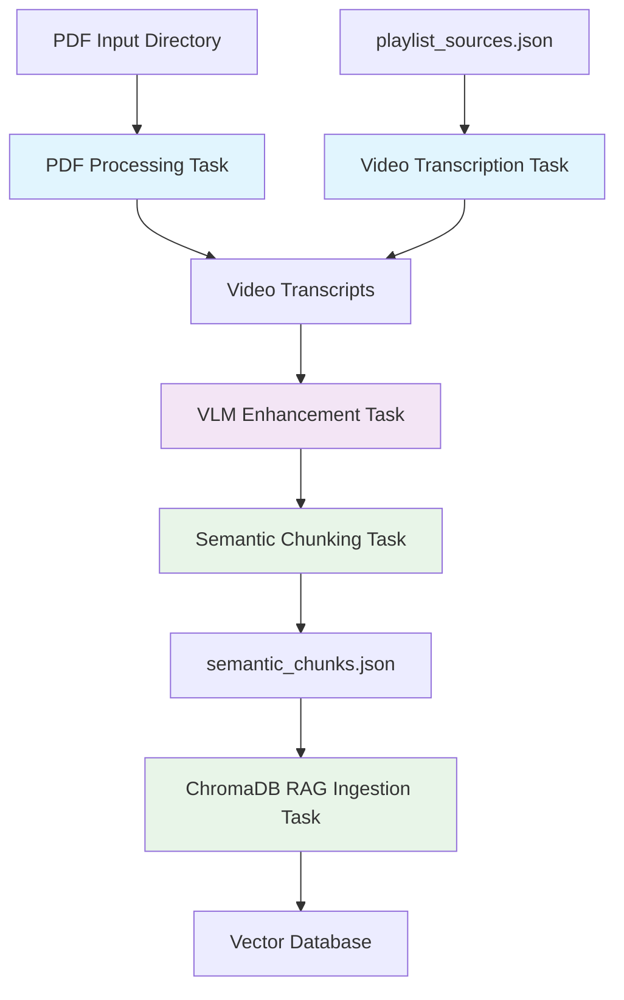
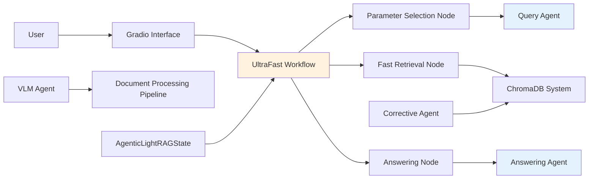

# Self-Learning RAG Pipeline

**Agentic document processing and intelligent question answering system**


## Architecture Overview

### Document Processing Pipeline



### Agentic Query System



## Key Features

- **Multi-Modal Processing**: PDFs, videos, and images with AI enhancement
- **Agentic Workflow**: Query analysis, retrieval optimization, and answer generation agents  
- **Fast Retrieval**: ChromaDB vector database with semantic chunking
- **State Management**: Session-aware conversation handling
- **Educational Focus**: Specialized for learning and knowledge extraction

## Performance Metrics

| Component | Performance |
|-----------|-------------|
| Knowledge Base | 9,989+ semantic chunks |
| Query Response | < 2 seconds average |
| Source Materials | 27 academic documents |
| Processing Pipeline | Parallel PDF + Video ingestion |

## Quick Start

### Prerequisites

```bash
# Python 3.8+
# UV package manager
# 8GB+ RAM recommended
```

### Installation

```bash
# Clone repository
git clone https://github.com/h19overflow/self-learning.git
cd self-learning

# Environment setup
uv sync

# Activate environment
# Windows:
.venv\Scripts\activate
# Linux/Mac:
source .venv/bin/activate
```

### Usage

```bash
# Explore knowledge base
python -m backend.storage.chromadb_info_extractor --summary

# Start interface
python -m backend.agentic_system.agentic_lightrag.gradio_interface_simplified

# Monitor pipelines
prefect server start
```

## System Components

### Document Pipeline Tasks

- **PDF Processing**: Converts PDFs to enriched Markdown
- **Video Transcription**: Extracts YouTube video transcripts
- **VLM Enhancement**: AI-powered image and diagram analysis
- **Semantic Chunking**: Creates meaningful text segments
- **ChromaDB Ingestion**: Stores vectors with metadata

### Agentic Workflow Nodes

- **Parameter Selection**: Optimizes retrieval parameters
- **Fast Retrieval**: Vector search with context assembly
- **Answering**: Educational response generation with source citations

### AI Agents

- **Query Agent**: Analyzes and categorizes user questions
- **Answering Agent**: Generates educational responses
- **VLM Agent**: Processes visual content
- **Corrective Agent**: Refines search queries

## Example Queries

- "Explain the attention mechanism in transformers"
- "How does LoRA improve fine-tuning efficiency?"
- "Compare different RAG architectures"
- "What are the key principles of atomic habits?"

---

**Built for educational AI research and knowledge extraction**