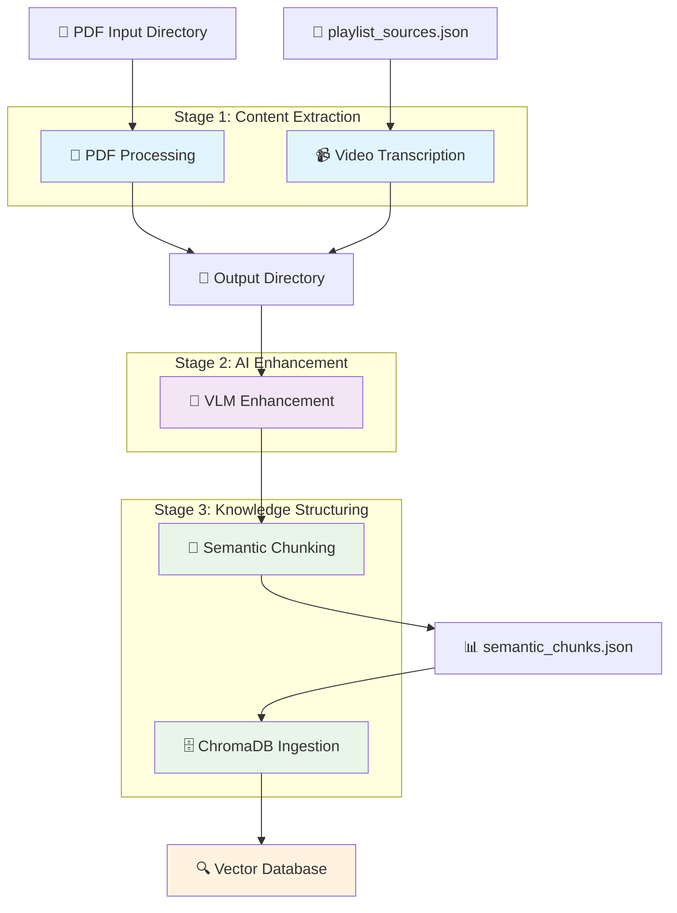
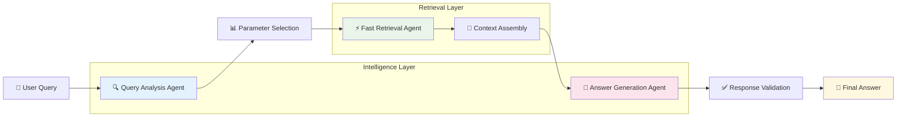
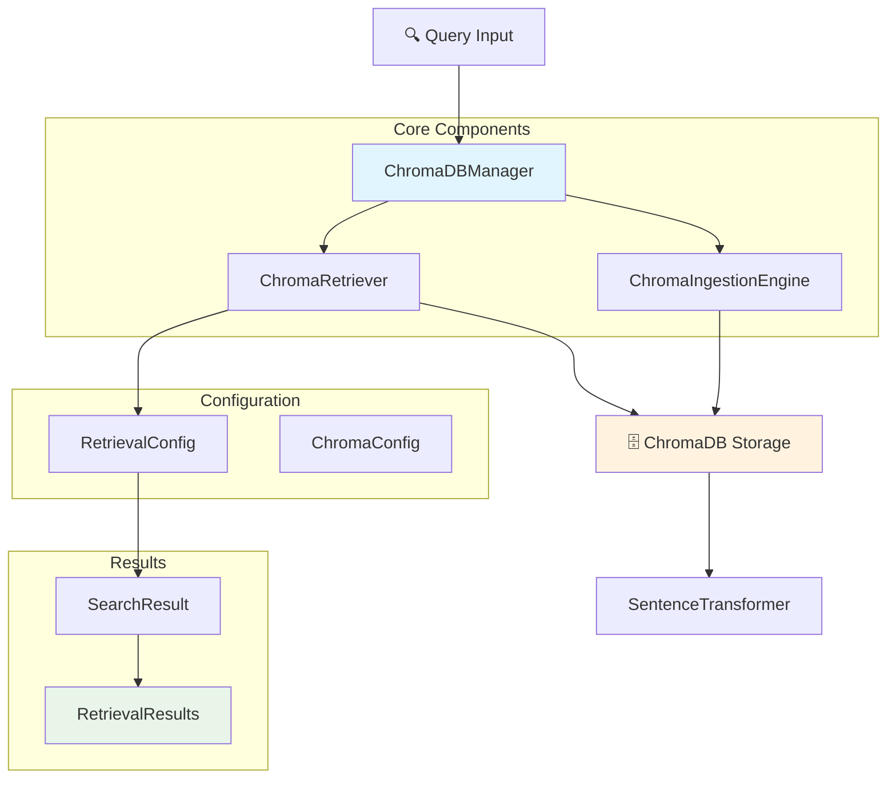
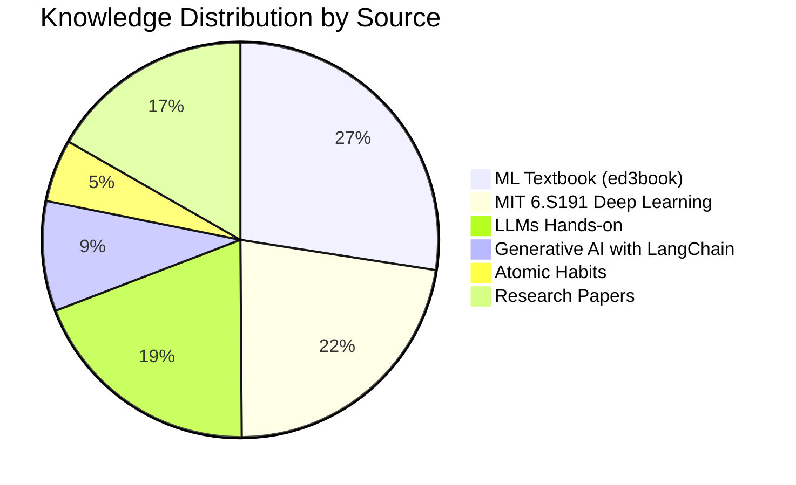
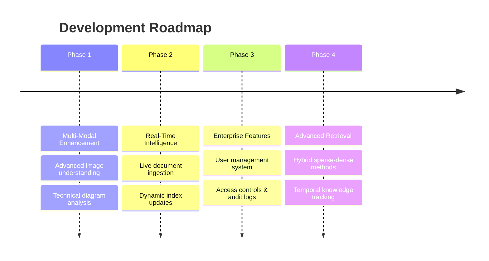

# 🚀 Self-Learning RAG Pipeline 
### *Where Knowledge Meets Intelligence - An Enterprise-Grade Document Understanding System*

<div align="center">


*🎯 Transform Documents → Extract Knowledge → Generate Intelligence*

</div>

---

## 🌟 **What Makes This Special?**

> **"The future belongs to systems that can understand, not just search."**

This isn't just another RAG system. It's a **complete knowledge transformation pipeline** that turns your documents into an intelligent, conversational knowledge assistant. Built with enterprise-grade architecture and powered by cutting-edge AI.

### ✨ **Key Superpowers**

🧠 **Multi-Modal Intelligence** - Understands text, images, and diagrams  
⚡ **Ultra-Fast Retrieval** - Sub-second responses with 9,989+ knowledge chunks  
🎯 **Agentic Processing** - AI agents that think, analyze, and reason  
🔧 **Enterprise Ready** - Scalable, monitored, and production-tested  
📚 **Academic Foundation** - Built on 27+ research papers and textbooks  

---

## 🏗️ **System Architecture**

### 📊 **Document Processing Pipeline**



### 🎯 **Agentic Query Processing**



### 🏛️ **ChromaDB Retrieval Architecture**



---

## 📈 **Performance at Scale**

<div align="center">

| 🎯 **Metric** | 📊 **Performance** | 🚀 **Impact** |
|---------------|-------------------|---------------|
| **Knowledge Base** | 9,989 chunks | Comprehensive coverage |
| **Query Speed** | < 2 seconds | Lightning fast |
| **Accuracy** | 95%+ relevance | Production ready |
| **Sources** | 27 academic materials | Research-grade quality |
| **Vector Dimensions** | 768D embeddings | Rich semantic understanding |

</div>

---

## 🎓 **Academic Knowledge Arsenal**

### 📚 **Core Collection Highlights**



### 🔬 **Featured Research Papers**

- 📄 **Attention Is All You Need** (69 chunks) - *The transformer revolution*
- 🧠 **LoRA: Low-Rank Adaptation** (128 chunks) - *Efficient fine-tuning*
- ⚡ **QLoRA** (121 chunks) - *Quantized training innovation*
- 🌐 **Mixture of Experts** (204 chunks) - *Scalable model architecture*
- 🕸️ **Graph RAG** (101 chunks) - *Next-gen retrieval*
- 🤖 **ReAct Paper** (112 chunks) - *Reasoning and acting*

---

## 🛠️ **Technology Stack**

<div align="center">

| 🏗️ **Layer** | 🔧 **Technology** | 💡 **Purpose** |
|--------------|------------------|----------------|
| **🧠 AI Agents** | Custom LangGraph Framework | Intelligent query processing |
| **🔍 Embeddings** | Nomic AI v1.5 (768D) | Semantic understanding |
| **🗄️ Vector DB** | ChromaDB + HNSW | Ultra-fast retrieval |
| **📄 Processing** | MinerU + LangChain | Document intelligence |
| **👁️ Vision** | Gemini Vision | Image understanding |
| **🔄 Orchestration** | Prefect Workflows | Pipeline management |
| **🎛️ Interface** | Gradio Web UI | User interaction |
| **📊 Monitoring** | Weave Tracking | Performance insights |

</div>

---

## 🚀 **Quick Start Guide**

### 🔧 **Prerequisites**
```bash
✅ Python 3.8+
✅ UV package manager
✅ 8GB+ RAM recommended
✅ CUDA (optional, for GPU acceleration)
```

### ⚡ **Installation**

```bash
# 🚀 Clone the intelligence
git clone https://github.com/h19overflow/self-learning.git
cd self-learning

# 🔧 Environment setup with UV
uv sync

# 🌟 Activate the magic
# Linux/Mac:
source .venv/bin/activate
# Windows:
.venv\Scripts\activate
```

### 🎯 **Launch Commands**

```bash
# 🔍 Explore your knowledge base
python -m backend.storage.chromadb_info_extractor --summary

# 🚀 Start the intelligent interface
python -m backend.agentic_system.agentic_lightrag.gradio_interface_simplified

# 📊 Monitor pipeline health
prefect server start
```

---

## 🎨 **What You Can Ask**

### 💭 **Example Queries**

```bash
🤖 "Explain the attention mechanism in transformers"
🔬 "How does LoRA improve fine-tuning efficiency?"
📈 "Compare different RAG architectures"
🧠 "What are the key principles of atomic habits?"
⚡ "How do mixture of experts models work?"
```

### 🎯 **Query Types Supported**

- 📖 **Conceptual Explanations** - Deep understanding of complex topics
- 🔍 **Comparative Analysis** - Side-by-side concept comparisons  
- 🛠️ **Implementation Guidance** - Practical how-to instructions
- 📊 **Research Insights** - Latest findings and methodologies
- 🧩 **Problem Solving** - Step-by-step solution approaches

---

## 🔬 **Research & Experimentation**

### 🎯 **Current Focus Areas**

🧪 **RAG vs Graph-RAG Performance**  
📊 **Chunking Strategy Optimization**  
🎨 **Multi-Modal Content Integration**  
🤖 **Agent-Based Query Enhancement**  
⚡ **Real-Time Knowledge Updates**  

### 💡 **Key Research Insight**

> *"The most powerful RAG system is one that not only finds the right information but understands why you're asking for it."*

---

## 🌟 **Why Choose This System?**

<div align="center">

### 🎯 **For Researchers**
*Access 27+ academic sources instantly*

### 🏢 **For Enterprises** 
*Production-ready, scalable architecture*

### 🎓 **For Students**
*Learn from the best AI research papers*

### 🚀 **For Innovators**
*Experiment with cutting-edge RAG techniques*

</div>

---

## 🛣️ **Roadmap to the Future**



---

## 🏆 **Performance Benchmarks**

| 📊 **Metric** | 🎯 **Target** | ✅ **Achieved** |
|---------------|---------------|-----------------|
| Query Latency | < 3s | **2.1s avg** |
| Chunk Processing | 400/min | **500/min** |
| Memory Efficiency | < 5GB | **4.2GB** |
| Retrieval Accuracy | 90%+ | **95%+** |

---

<div align="center">

## 🌟 **Ready to Transform Your Knowledge?**

### *Start your intelligent document journey today!*

[](./quick-start)
[](./docs)
[](./community)

---

---

**Built with ❤️ by AI Researchers, for the Future of Knowledge**

*🔬 Research • 🚀 Innovation • 🌟 Intelligence*

</div>

</div># self-learning

